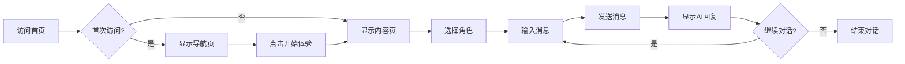

## 1. Product Overview
AI对话助手是一款智能对话工具，提供多角色、多模态的对话体验。目标是打造一个简约清新、低AI感的用户界面，让用户专注于内容交流而非技术本身。

## 2. Core Features

### 2.1 User Roles
| Role | Registration Method | Core Permissions |
|------|---------------------|------------------|
| Normal User | Local storage | Use all features without login |

### 2.2 Feature Module
1. **导航页（WelcomePage）**: Hero区域、功能特性展示、模拟交互演示、进入按钮
2. **内容页（ChatPage）**: 聊天界面、角色切换、消息输入、语音输入、图片上传

### 2.3 Page Details
| Page Name | Module Name | Feature description |
|-----------|-------------|---------------------|
| 导航页 | Hero区域 | 简洁标题、副标题、主CTA按钮 |
| 导航页 | 功能特性 | 卡片式展示5大核心功能 |
| 导航页 | 模拟交互 | 展示对话效果的实时演示区域 |
| 内容页 | 聊天区域 | 消息列表、滚动、打字指示器 |
| 内容页 | 输入区域 | 文本输入、语音输入、图片上传 |

## 3. Core Process

## 4. User Interface Design

### 4.1 Design Style
- **主色调**: 清新蓝 (#0ea5e9)
- **辅助色**: 翡翠绿 (#10b981) - 用户消息气泡
- **背景**: 浅灰渐变 (#fafbfc → #f1f5f9)
- **卡片**: 白色 (#ffffff)
- **文字**: 深色 (#1e293b) / 次要 (#64748b)
- **边框**: 浅灰 (#e2e8f0)

- **按钮风格**: 圆角 (1.75rem)、渐变背景、悬停上浮效果
- **卡片风格**: 圆角 (24px)、多层阴影、玻璃质感
- **图标**: 统一使用SVG，避免emoji

### 4.2 Page Design Overview

| Page Name | Module Name | UI Elements |
|-----------|-------------|-------------|
| 导航页 | Hero区域 | 居中布局、渐变背景、简洁标题、主CTA按钮 |
| 导航页 | 功能特性 | 5张卡片、横向排列、图标+文字、悬停动画 |
| 导航页 | 模拟交互 | 对话气泡演示、自动滚动、打字效果模拟 |
| 内容页 | Header | 菜单按钮、角色选择、新建对话按钮 |
| 内容页 | 聊天区域 | 消息气泡、用户/助手区分、滚动到底部 |
| 内容页 | 输入区域 | 文本框、语音按钮、图片上传、发送按钮 |

### 4.3 Responsiveness
- **移动端优先**: 375px断点
- **平板**: 768px断点
- **桌面**: 1024px断点
- **触摸优化**: 按钮最小44px

### 4.4 交互设计
- **按钮悬停**: 上移2px、阴影增强
- **卡片悬停**: 缩放1.02、阴影变化
- **页面切换**: 淡入淡出动画
- **打字指示器**: 脉冲动画

## 5. 风格要求
- 避免AI感: 移除机器人图标、紫色渐变
- 简约清新: 干净的配色、充足的留白
- 专业感: 统一的图标风格、一致的间距系统
- 无破坏性功能: 所有UI改动不影响现有业务逻辑