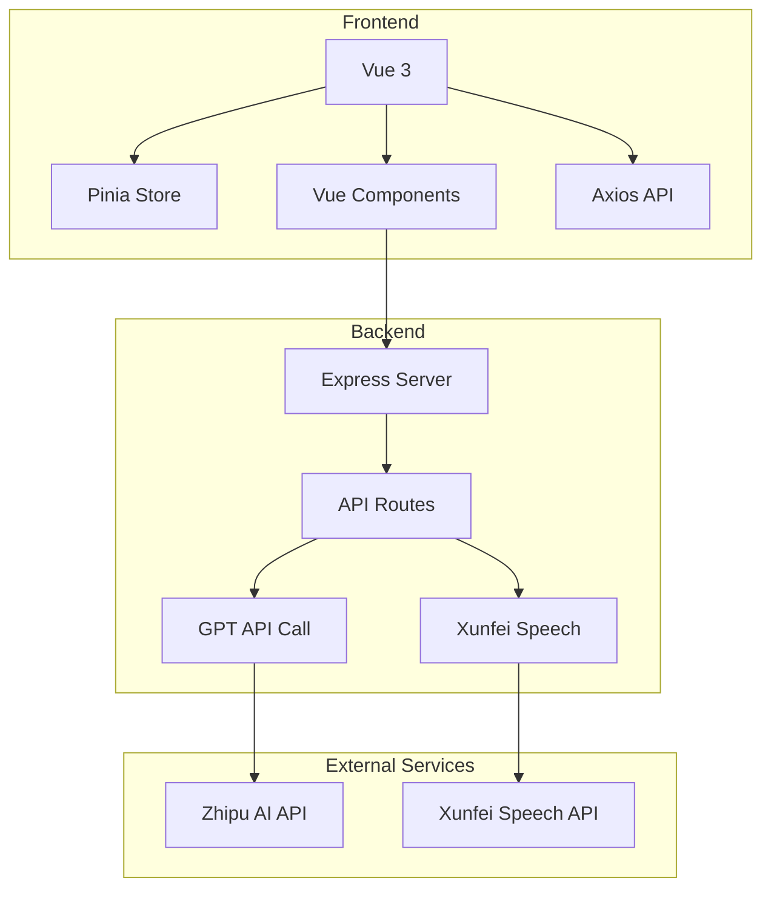

## 1. Architecture Design



## 2. Technology Description
- **Frontend**: Vue@3 + Vite@4 + Pinia + Axios
- **Backend**: Express@5 + Node.js
- **Styling**: Scoped CSS with CSS Variables
- **Icon**: SVG inline icons

## 3. Route Definitions
| Route | Purpose |
|-------|---------|
| / | 首页（导航页或内容页） |

## 4. API Definitions

### 4.1 /api/chat (POST)
- **Request**: `{ messages: Message[], systemPrompt: string, stream?: boolean }`
- **Response**: `{ reply: string }` (非流式) 或 Server-Sent Events (流式)

### 4.2 /api/vision (POST)
- **Request**: `{ imageBase64: string, prompt?: string }`
- **Response**: `{ reply: string }`

### 4.3 /api/xunfei_token (GET)
- **Response**: `{ wsUrl: string, appId: string }`

### 4.4 /api/generate-title (POST)
- **Request**: `{ messages: Message[] }`
- **Response**: `{ title: string }`

## 5. Component Structure

```
src/
├── components/
│   ├── WelcomePage.vue      # 导航页
│   ├── Header.vue           # 顶部导航
│   ├── Sidebar.vue          # 侧边栏
│   ├── ChatArea.vue         # 聊天区域
│   ├── InputArea.vue        # 输入区域
│   ├── chat/
│   │   ├── ChatMessage.vue  # 消息气泡
│   │   ├── WelcomeScreen.vue # 聊天欢迎页
│   │   └── TypingIndicator.vue # 打字指示器
│   ├── sidebar/
│   │   ├── SidebarHeader.vue
│   │   ├── NewChatButton.vue
│   │   ├── ConversationGroup.vue
│   │   └── ConversationItem.vue
│   └── input/
│       ├── TextInput.vue
│       ├── SendButton.vue
│       ├── ImageUploader.vue
│       └── VoiceHint.vue
├── composables/             # 组合式函数
├── stores/                  # Pinia stores
├── styles/                  # 全局样式
└── App.vue                  # 主应用入口
```

## 6. State Management

### 6.1 Chat Store (stores/chat.js)
```typescript
interface ChatState {
    messages: Message[]
    currentRoleId: string
    isLoading: boolean
    isTyping: boolean
}

interface Message {
    id: string
    role: 'user' | 'assistant'
    content: string
    image?: string
    timestamp: number
}
```

## 7. CSS Variables (src/styles/variables.css)

```css
:root {
    /* 主色调 */
    --primary-color: #0ea5e9;
    --primary-dark: #0284c7;
    
    /* 辅助色 */
    --secondary-color: #10b981;
    --secondary-dark: #059669;
    
    /* 背景色 */
    --bg-primary: #fafbfc;
    --bg-secondary: #f1f5f9;
    --bg-card: #ffffff;
    
    /* 文字色 */
    --text-primary: #1e293b;
    --text-secondary: #64748b;
    --text-muted: #94a3b8;
    
    /* 边框色 */
    --border-color: #e2e8f0;
    
    /* 阴影 */
    --shadow-sm: 0 1px 2px rgba(0, 0, 0, 0.05);
    --shadow-md: 0 4px 6px rgba(0, 0, 0, 0.05);
    --shadow-lg: 0 10px 15px rgba(0, 0, 0, 0.05);
    
    /* 圆角 */
    --radius-sm: 8px;
    --radius-md: 16px;
    --radius-lg: 24px;
    
    /* 间距 */
    --spacing-xs: 4px;
    --spacing-sm: 8px;
    --spacing-md: 16px;
    --spacing-lg: 24px;
    --spacing-xl: 32px;
}
```

## 8. UI Implementation Guidelines

### 8.1 导航页优化
1. **Hero区域**: 居中布局，渐变背景，简洁标题
2. **功能卡片**: 5张卡片横向排列，SVG图标，悬停动画
3. **模拟交互**: 自动播放的对话演示，打字效果

### 8.2 内容页优化
1. **Header**: 简化logo，移除机器人图标
2. **聊天气泡**: 用户消息用翡翠绿，助手用浅灰
3. **输入区域**: 圆角输入框，渐变发送按钮
4. **侧边栏**: 平滑滑入动画

### 8.3 性能考虑
- 使用CSS transform进行动画，避免layout thrashing
- 消息列表使用虚拟滚动（如果消息量大）
- 图片懒加载

### 8.4 无障碍
- 所有按钮有aria-label
- 键盘导航支持
- 颜色对比度符合WCAG标准